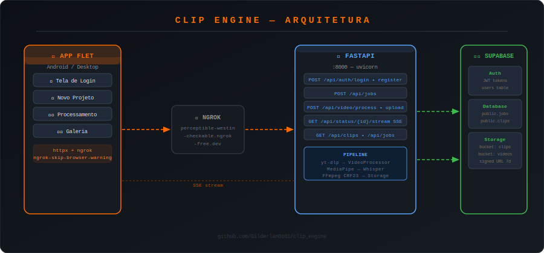
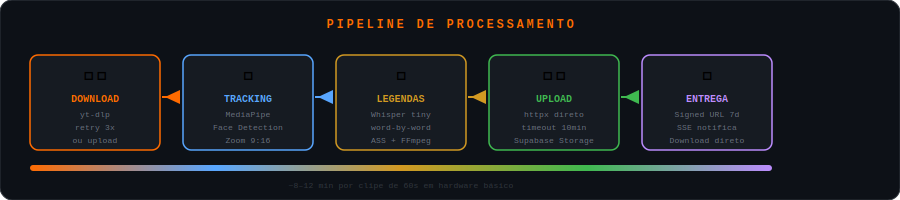
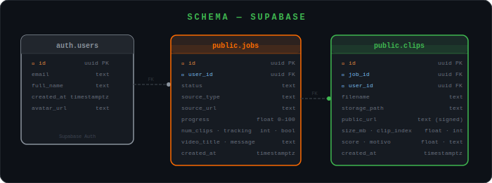
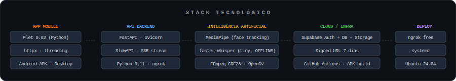

<div align="center">


# CLIP ENGINE

[](https://python.org)
[](https://flet.dev)
[](https://fastapi.tiangolo.com)
[](https://supabase.com)
[](LICENSE)
[]()
[]()

### Transforme vídeos longos em Shorts e Reels automaticamente — com IA, tracking de rosto e legendas word-by-word. 🚀

[📱 Baixar APK](#-instalação) · [📖 Documentação API](#-api-endpoints) · [🎬 Ver resultados](#-resultados)

</div>

---

## 📋 Sobre o Projeto

O **Clip Engine** é um sistema completo — app mobile + API backend — que processa automaticamente vídeos do YouTube ou uploads locais e gera clipes prontos para publicação em formato vertical 9:16 (Shorts, Reels, TikTok).

Tudo acontece automaticamente: o app envia a URL ou o vídeo, a API processa com IA, e os clipes aparecem na galeria do celular prontos para download.

---

## ✨ Funcionalidades

| Funcionalidade | Descrição |
|---|---|
| 🎯 **Face Tracking** | MediaPipe detecta e acompanha o rosto do falante em tempo real, aplicando zoom dinâmico no formato 9:16 |
| 📝 **Legendas Word-by-Word** | Whisper transcreve o áudio e renderiza legendas palavra por palavra no estilo Alex Hormozi |
| 🎨 **Cores de legenda** | Branco, amarelo, azul ou verde — com preview em tempo real no app |
| ☁️ **Nuvem integrada** | Clipes salvos automaticamente no Supabase Storage com signed URL de 7 dias |
| 📱 **App Android** | App nativo em Python/Flet com download direto no dispositivo |
| ⚡ **SSE em tempo real** | O app recebe updates do pipeline sem polling — conexão única, zero spam |
| 🛡️ **Censura automática** | Detecta e mascara palavras sensíveis no áudio |
| 😄 **Emojis contextuais** | Palavras como "dinheiro 💰" e "sucesso 🚀" ganham emojis automaticamente |

---

## 🎬 Resultados

<!-- BEGIN YOUTUBE-CARDS -->
[](https://www.youtube.com/shorts/NRN5rjaphgM)
[](https://www.youtube.com/shorts/e7RqpPVQ0mg)
[](https://www.youtube.com/shorts/-r2U_PGeILk)
[](https://www.youtube.com/shorts/VzWNptoU3bY)
[")](https://www.youtube.com/shorts/x-rsuYYfk0Y)
[](https://www.youtube.com/shorts/OU_kph4x3ac)
<!-- END YOUTUBE-CARDS -->

---

## 🏗️ Arquitetura



O sistema é dividido em duas partes independentes:

- **`/app`** — App Flet em Python. Roda no Android e Desktop. Toda a UI, configurações e download de clipes. Comunica com a API via `httpx`.
- **`/api`** — Backend FastAPI em Python. Recebe os vídeos, roda o pipeline de IA e salva os clipes no Supabase. Exposto via ngrok.

---

## ⚡ Pipeline de Processamento



1. **Download** — `yt-dlp` baixa o vídeo do YouTube com retry automático (3x). Ou recebe upload direto do app.
2. **Tracking** — `MediaPipe` detecta os rostos frame a frame e aplica crop dinâmico no formato 9:16 com `OpenCV`.
3. **Legendas** — `faster-whisper` transcreve o áudio offline e `FFmpeg` queima as legendas com CRF 23.
4. **Upload** — `httpx` faz upload direto para o Supabase Storage (bucket `clips`) com timeout de 10 minutos.
5. **Entrega** — Signed URL de 7 dias é gerada e enviada ao app via SSE. Download disponível na Galeria.

---

## 🗄️ Banco de Dados



Três tabelas no Supabase:

- **`auth.users`** — gerenciado pelo Supabase Auth (JWT, OAuth)
- **`public.jobs`** — cada processamento iniciado pelo usuário. Armazena status e progresso 0–100.
- **`public.clips`** — cada clipe gerado, com `storage_path`, `public_url` (signed) e metadados.

---

## 🛠️ Stack Tecnológico



---

## 🚀 Instalação

### Pré-requisitos

- Python 3.11+
- FFmpeg instalado e no PATH
- Conta no [Supabase](https://supabase.com) (gratuita)
- Conta no [ngrok](https://ngrok.com) (gratuita)

### 1. Clone o repositório

```bash
git clone https://github.com/Gilderlan0101/clip_engine.git
cd clip_engine
```

### 2. Configure a API

```bash
cd api
python3.11 -m venv .venv
source .venv/bin/activate
pip install -r requirements.txt
```

Crie o arquivo `.env` na pasta `api/`:

```env
SUPABASE_URL=https://SEU_PROJETO.supabase.co
SUPABASE_ANON_KEY=sua_anon_key
SUPABASE_SERVICE_KEY=sua_service_role_key
```

### 3. Configure o App

```bash
cd ../app
pip install flet==0.82.2 httpx==0.28.1
```

### 4. Crie os buckets no Supabase

No painel do Supabase → Storage → New bucket:
- `clips` (privado)
- `videos` (privado)

### 5. Suba tudo

```bash
# Terminal 1 — API
cd api && ./run.sh

# Terminal 2 — ngrok (domínio fixo gratuito)
ngrok http --domain=SEU_DOMINIO.ngrok-free.app 8000

# Terminal 3 — App (desenvolvimento)
cd app && flet run main.py

# App Android
cd app && flet run --android main.py
```

---

## 📱 Gerando o APK

O APK é gerado automaticamente pelo GitHub Actions a cada push na branch `master`.

```bash
git push origin master
# Aguarde ~10 minutos
# APK disponível em: Actions → Artifacts ou Releases
```

Para gerar localmente:

```bash
cd app
flet build apk --module-name main --project "ClipEngine" --org "com.devorbit.clipengine"
```

---

## 📡 API Endpoints

| Método | Rota | Descrição |
|--------|------|-----------|
| `POST` | `/api/auth/login` | Login com email e senha |
| `POST` | `/api/auth/register` | Criação de conta |
| `POST` | `/api/jobs` | Cria job antes do pipeline |
| `GET` | `/api/jobs?user_id=` | Lista jobs do usuário |
| `POST` | `/api/video/process` | Inicia pipeline via URL YouTube |
| `POST` | `/api/video/upload` | Inicia pipeline via upload de arquivo |
| `GET` | `/api/status/{task_id}` | Snapshot do status atual |
| `GET` | `/api/status/{task_id}/stream` | SSE — updates em tempo real |
| `GET` | `/api/clips?user_id=` | Lista clipes do usuário |
| `GET` | `/api/clips/{id}` | Detalhes de um clipe |
| `POST` | `/api/clips/{id}/refresh-url` | Renova signed URL (7 dias) |

Documentação interativa disponível em: `http://localhost:8000/docs`

---

## 📁 Estrutura do Projeto

```
clip_engine/
├── app/                        # App mobile/desktop (Flet)
│   ├── main.py                 # Entry point
│   ├── assets/icons/icon.png   # Ícone do app
│   ├── requirements.txt
│   └── src/views/
│       ├── auth.py             # Tela de login/cadastro
│       ├── home.py             # Aba Novo Projeto
│       ├── gallery.py          # Galeria de clipes (cloud)
│       ├── processing.py       # Status dos jobs
│       ├── components.py       # Componentes reutilizáveis
│       └── theme.py            # Cores e estilos
│
├── api/                        # Backend FastAPI
│   ├── main_api.py             # Entry point
│   ├── run.sh                  # Script de inicialização
│   ├── requirements.txt
│   └── src/
│       ├── api/routes/         # Rotas HTTP
│       │   ├── jobs.py         # CRUD jobs
│       │   ├── clips.py        # CRUD clips
│       │   ├── video.py        # Pipeline YouTube
│       │   ├── upload.py       # Pipeline upload
│       │   ├── status.py       # SSE status
│       │   ├── login.py        # Auth login
│       │   └── register.py     # Auth register
│       ├── services/
│       │   ├── storage_service.py   # Upload Supabase (httpx direto)
│       │   ├── transcriber.py       # Whisper + legendas ASS
│       │   └── downloader.py        # yt-dlp wrapper
│       ├── controllers/
│       │   └── video_processing/
│       │       └── video_processor.py  # MediaPipe + OpenCV
│       └── database/
│           └── supabase_client.py   # Cliente Supabase
│
├── docs/                       # Diagramas SVG
│   ├── arch.svg
│   ├── pipeline.svg
│   ├── schema.svg
│   └── stack.svg
│
└── .github/workflows/
    └── build_apk.yml           # CI/CD — gera APK automaticamente
```

---

## ⚙️ Configurações do App

No app, antes de iniciar um projeto você pode configurar:

| Configuração | Opções | Padrão |
|---|---|---|
| Quantidade de clipes | 1 a 10 | 3 |
| Duração por clipe | 30s / 60s / 90s | 60s |
| Legendas | ON / OFF | ON |
| Cor da legenda | Branco / Amarelo / Azul / Verde | Branco |
| Formato | 9:16 (Shorts) / 16:9 (Landscape) | 9:16 |
| Face tracking | ON / OFF | ON |

---

## 🤝 Contribuindo

1. Fork o projeto
2. Crie uma branch (`git checkout -b feature/MinhaFeature`)
3. Commit suas mudanças (`git commit -m 'feat: adiciona nova feature'`)
4. Push para a branch (`git push origin feature/MinhaFeature`)
5. Abra um Pull Request

---

## 👨‍💻 Autor

**Gilderlan**

[](https://github.com/Gilderlan0101)
[](mailto:lansilva007gg@gmail.com)

---

<div align="center">

Se este projeto foi útil, deixa uma ⭐ no repositório!

Feito com ❤️ e muita ☕ por Gilderlan em 2026

</div>
